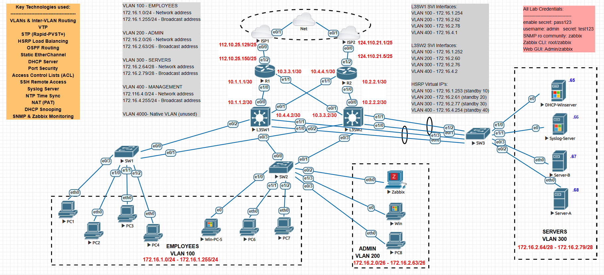
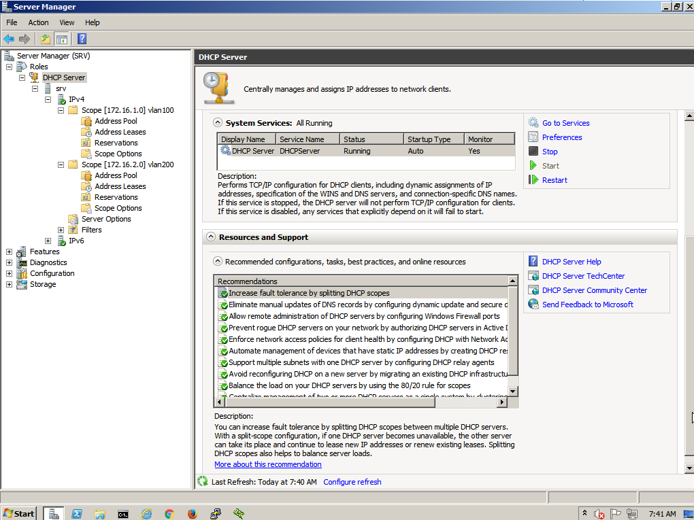
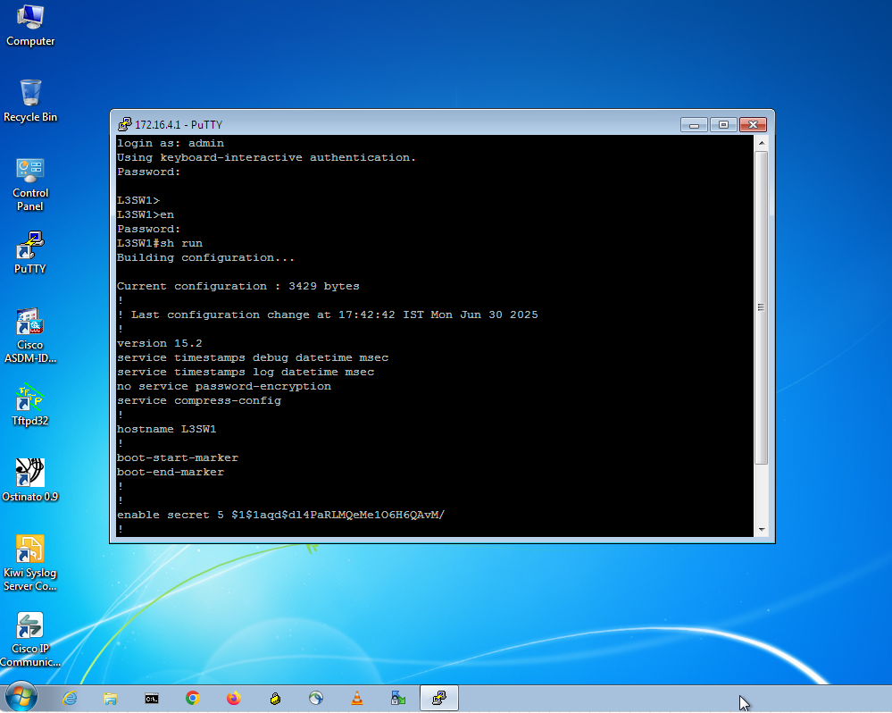
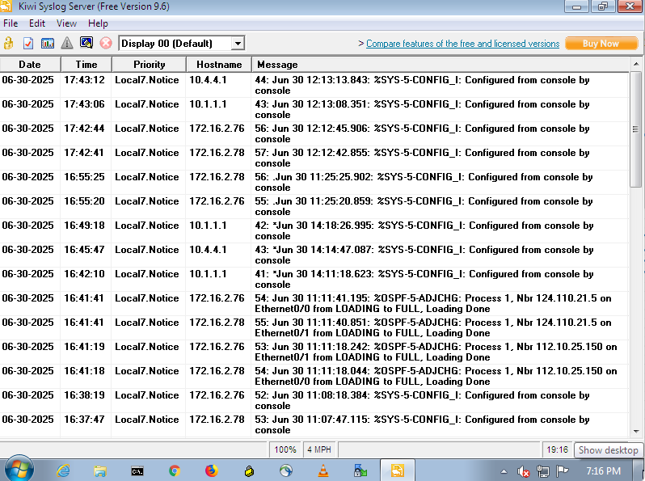
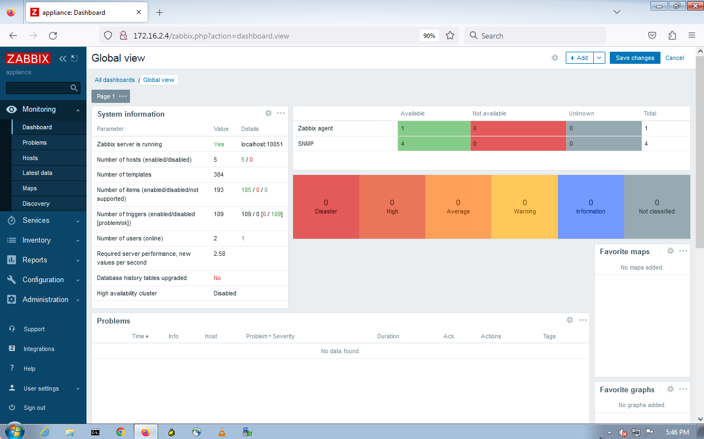
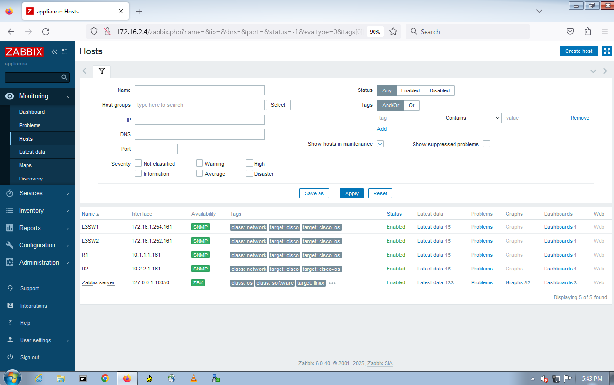

# Comprehensice CCNA Enterprise Lab 

## Overview
Successfully designed, built, and managed a complete enterprise network topology from the ground up in the **EVE-NG** simulation environment, validating a wide range of networking skills.

---

## Key Highlights

### 📉 **Architecture & High Availability**
- Implemented a **redundant spine-leaf** architecture with dual-homed links.
- Configured **dual ISP uplinks** using **OSPF + PAT** for internet redundancy and failover.
- Deployed **HSRP** for first-hop gateway redundancy and load balancing.
- Used **EtherChannel** to increase bandwidth between core and server farm.
- Centralized **DHCP Server** hosted on a Windows Server using **DHCP Relay**.

### 📍 **Routing & Switching**
- Created multiple **VLANs** and deployed **VTP** for VLAN consistency.
- Configured **inter-VLAN routing** on **Layer 3 switches**.
- Enabled **Rapid-PVST+** for loop-free topology and better convergence.

### 🔐 **Security & Access Control**
- Applied **Port Security** on access switches to restrict MAC address flooding.
- Enabled **DHCP Snooping** to prevent rogue DHCP attacks.
- Wrote **ACLs** to control inter-VLAN traffic.
- Configured **SSH** access and restricted it to the **admin VLAN**.

### 📊 **Network Management & Monitoring**
- All devices synchronized with **NTP** for consistent timekeeping.
- Configured centralized **Syslog** server to collect logs from all devices.

- Enabled **SNMP** for proactive monitoring.
- Integrated **Zabbix** server to visualize device status and metrics.

---

## Technologies Used (CCNA Topics Covered)
- VLANs & Inter-VLAN Routing
- VTP (VLAN Trunking Protocol)
- STP (Rapid-PVST+)
- HSRP Load Balancing
- OSPF Dynamic Routing
- Static EtherChannel
- DHCP Server Configuration
- Port Security
- Access Control Lists (ACLs)
- SSH Remote Access
- Syslog Server Setup
- NTP Time Synchronization
- NAT (PAT)
- DHCP Snooping
- SNMP Monitoring with Zabbix

---

## Lab Environment

This lab was built and simulated using the following platform and virtual device images:

| Component       | Details                                                                 |
|----------------|-------------------------------------------------------------------------|
| **Platform**   | EVE-NG (Emulated Virtual Environment - Next Generation)                 |
| **L3 Switches**| Cisco IOL (IOS on Linux) L3 Image: `i86bi_linux_l2-adventerprisek9-ms.SSA.high_iron_20190423.bin` |
| **Routers**    | Cisco Dynamips Image: `c7200-adventerprisek9-mz.152-4.S6.image`         |
| **Switches**   | Cisco IOL (IOS on Linux) L2 Image: `i86bi_linux_l2-adventerprisek9-ms.SSA.high_iron_20190423.bin` |
| **End Devices**| Windows Server (for DHCP), Virtual PCs                                  |

---

## Configurations
Click on each device name to view the configuration file:

- [ISP1](assets/ISP1.txt)
- [ISP2](assets/ISP2.txt)
- [L3SW1](assets/L3SW1.txt)
- [L3SW2](assets/L3SW2.txt)
- [R1](assets/R1.txt)
- [R2](assets/R2.txt)
- [SW1](assets/SW1.txt)
- [SW2](assets/SW2.txt)
- [SW3](assets/SW3.txt)

---

